## 1. YouTube.com

### Output
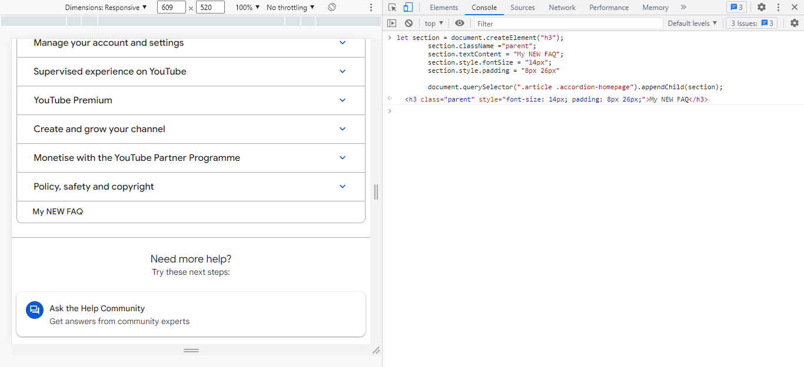

### Code
```
let section = document.createElement("h3");
section.className ="parent";
section.textContent = "My NEW FAQ";
section.style.fontSize = "14px";
section.style.padding = "8px 26px"
document.querySelector(".articlaccordion-homepage").appendChild(section);
```
## 2. Oneplus

### Output
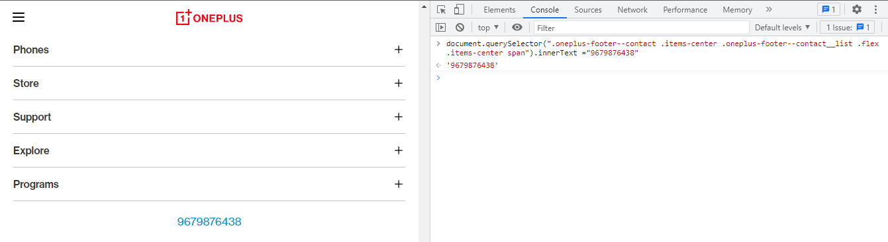

### Code
```
document.querySelector(".oneplus-footer--contact .items-center .oneplus-footer--contact__list .flex .items-center span").innerText ="9679876438"
```

## 2. Samsung

### Output
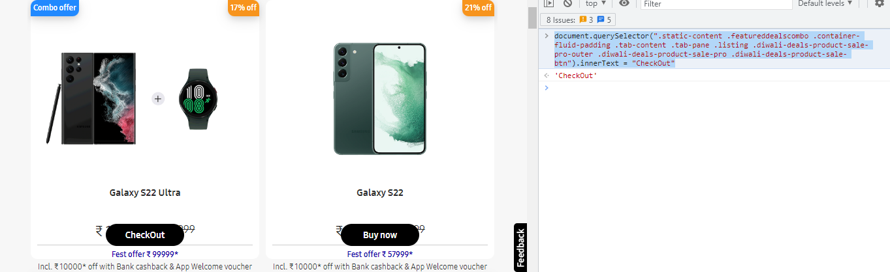

### Code
```
document.querySelector(".static-content .featureddealscombo .container-fluid-padding .tab-content .tab-pane .listing .diwali-deals-product-sale-pro-outer .diwali-deals-product-sale-pro .diwali-deals-product-sale-btn").innerText = "CheckOut"
```
## 3. Adidas

### Output
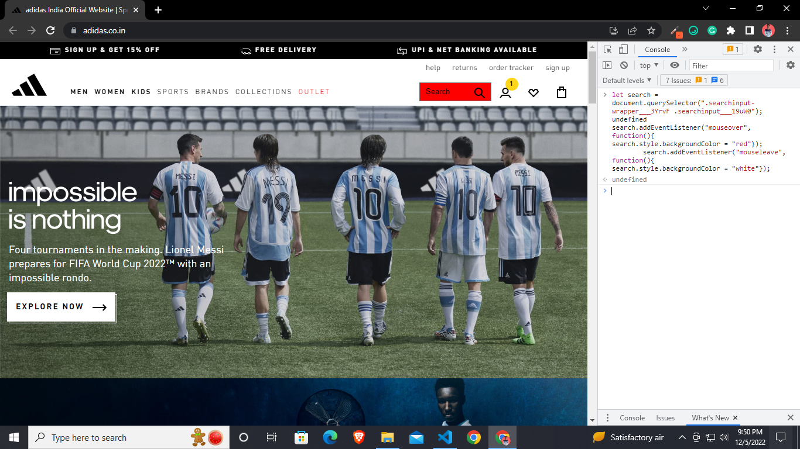

### Code
```
let search = document.querySelector(".searchinput-wrapper___3YrvF .searchinput___19uW0");

search.addEventListener("mouseover", function(){
search.style.backgroundColor = "red"});

search.addEventListener("mouseleave", function(){
search.style.backgroundColor = "white"});
```

<!-- ## 7. mdn

### output

### Code
```
let search = document.querySelector(".homepage-hero-search .search-widget .search-input-field");
search.value = "javascript";
``` -->

## 4. Google.com

### output

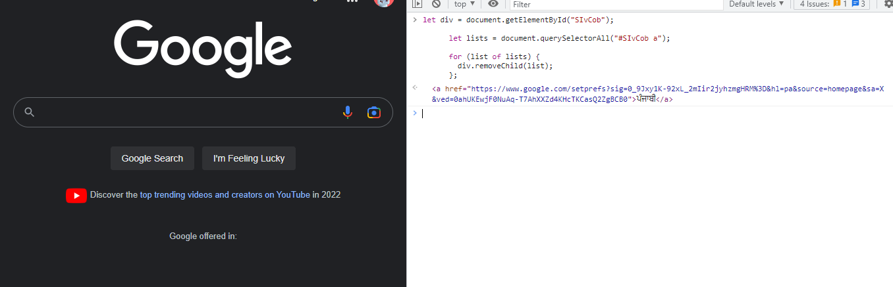

### Code
```
 let div = document.getElementById("SIvCob");

      let lists = document.querySelectorAll("#SIvCob a");

      for (list of lists) {
        div.removeChild(list[3]);
      }
```

## 5. Codewars

### output

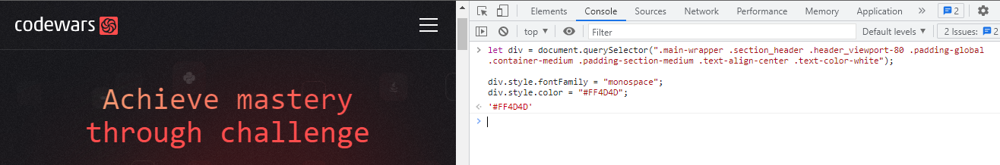;

### Code
```
let div = document.querySelector(".main-wrapper .section_header .header_viewport-80 .padding-global .container-medium .padding-section-medium .text-align-center .text-color-white");

div.style.fontFamily = "monospace";
div.style.color = "#FF4D4D";
```

## 6. freecodecamp

### outcome
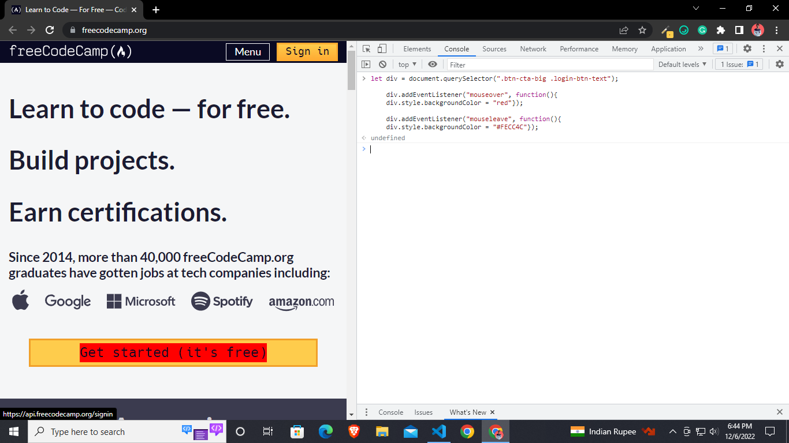

### Code
```
let div = document.querySelector(".btn-cta-big .login-btn-text");

div.addEventListener("mouseover", function(){
div.style.backgroundColor = "red"})
div.addEventListener("mouseleave", function(){
div.style.backgroundColor = "#FECC4C"});
```

## 7. Realme

### Outcome
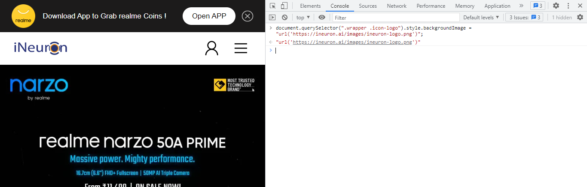

### Code
```
document.querySelector(".wrapper .icon-logo").style.backgroundImage = "url('https://ineuron.ai/images/ineuron-logo.png')";
"url('https://ineuron.ai/images/ineuron-logo.png')"
```
## 8. Github

### Outcome
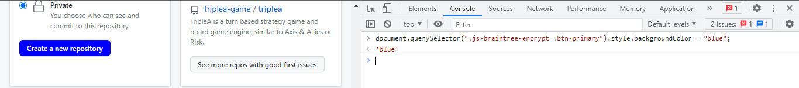

### Code
```
document.querySelector(".js-braintree-encrypt .btn-primary").style.backgroundColor = "blue";
```

## 9. HackerRank

### Output
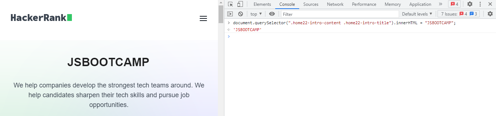

### Code
```
document.querySelector(".home22-intro-content .home22-intro-title").innerHTML = "JSBOOTCAMP";
```

## 10. Asus

### Outcome
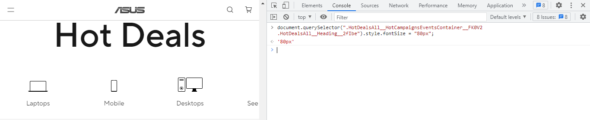

### Code
```
document.querySelector(".HotDealsAll__HotCampaignsEventsContainer__FK0V2 .HotDealsAll__Heading__2fIbe").style.fontSize = "80px";
```

## 11. Vercel

### Outcome
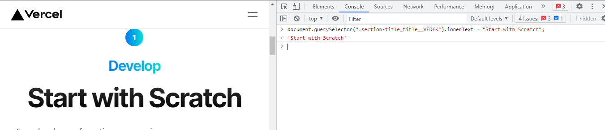

### Code
```
document.querySelector(".section-title_title__VEDfK").innerText = "Start with Scratch";
```

## 12. Sony

### Outcome
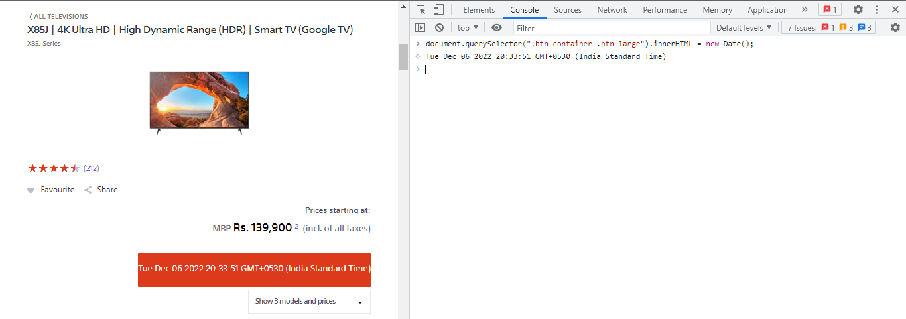

### Code
```
document.querySelector(".btn-container .btn-large").innerHTML = new Date();
```
## 13. Oppo

### Output
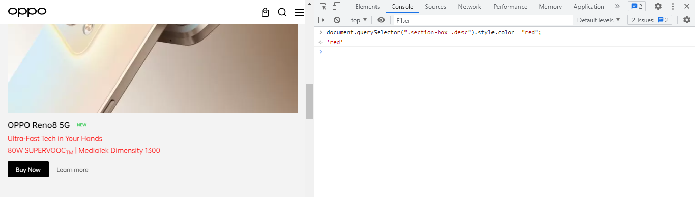

### Code
```
document.querySelector(".section-box .desc").style.color= "red";
```


